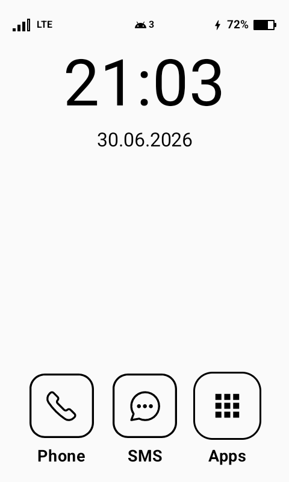
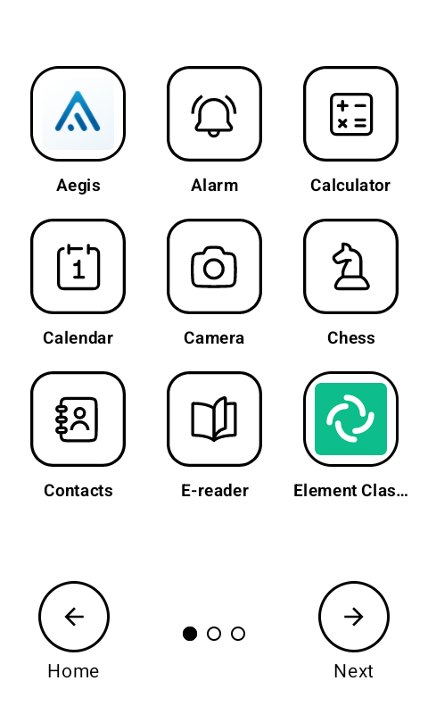
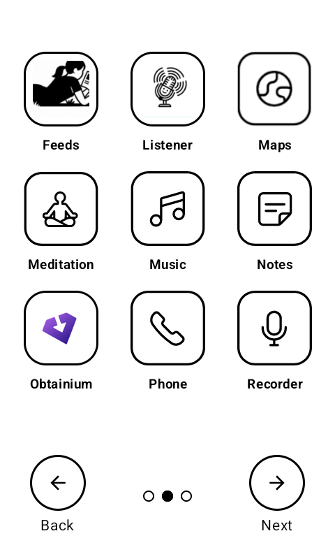
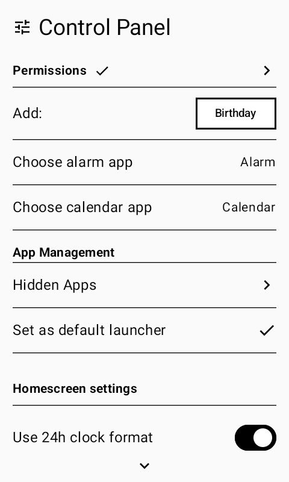
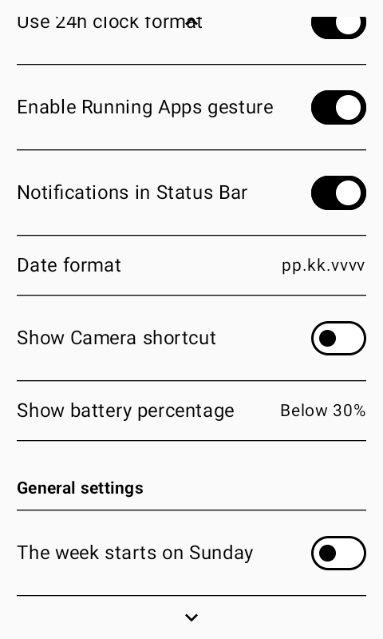
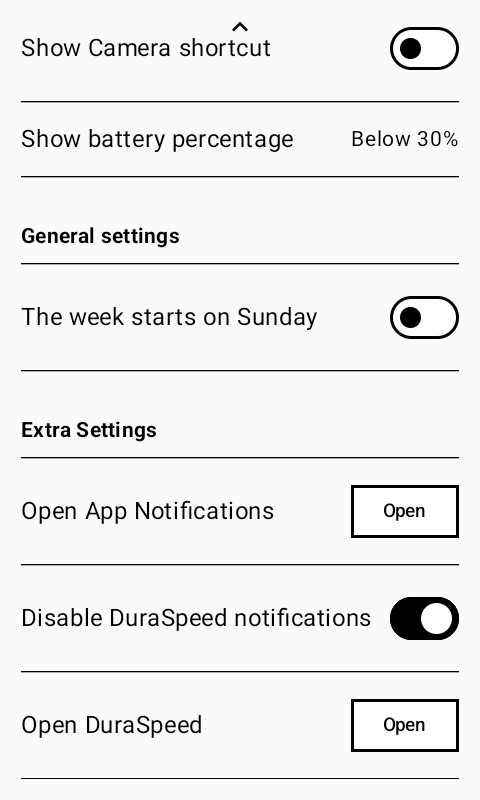
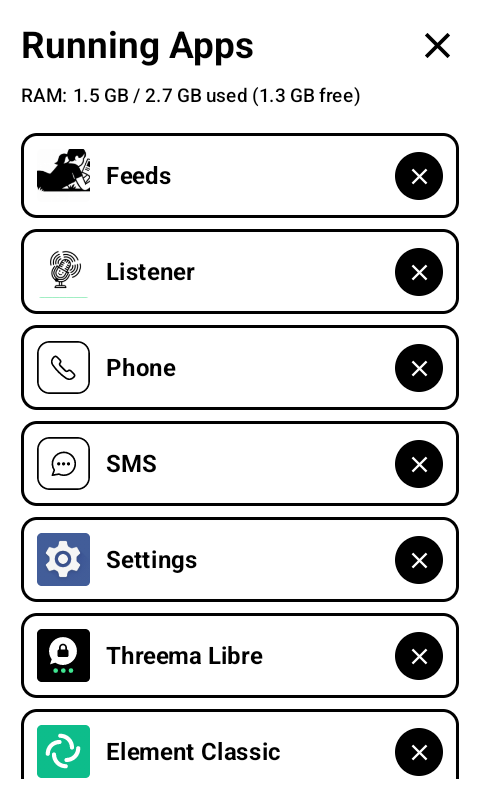
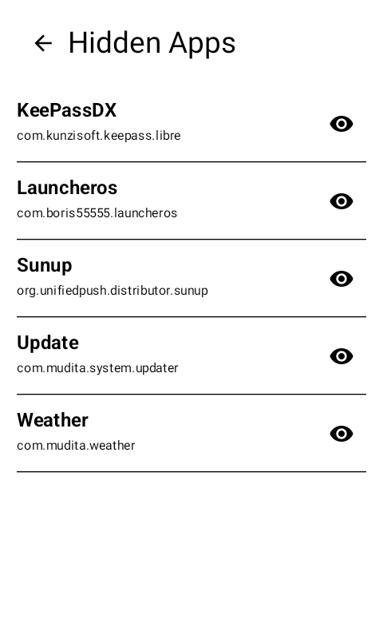
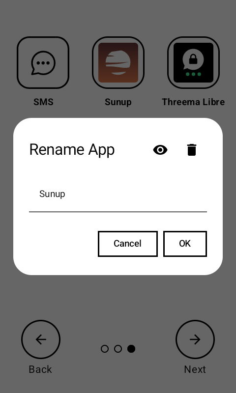

# Launcheros

Launcheros is a minimalist Android launcher specifically designed for the **Mudita Kompakt** phone. It follows the device's original and clean design language while introducing highly requested features for power users.

## Features

-   **Minimalist Design:** Closely follows the original Mudita Kompakt launcher style and minimalist aesthetics.
-   **Expanded Notifications:** Allows receiving and displaying notifications from third-party applications, improving usability for everyday needs.
-   **Smart Notification View:** Filters unnecessary noise and groups important events (calls, messages, media) into a clear overview.
-   **Integrated Mini Player:** Control music and podcasts directly from the home screen with a minimalist control bar.
-   **App Management:** Ability to hide apps and rename them to match your personal style.
-   **Birthday Reminders:** Built-in support for tracking and notifying you about upcoming birthdays.

## License

This project is licensed under the **Apache License 2.0**. See the [LICENSE](LICENSE) file for more details.

---

<table>
  <tr>
    <td></td>
    <td></td>
    <td></td>
  </tr>
  <tr>
    <td></td>
    <td></td>
    <td></td>
  </tr>
  <tr>
    <td></td>
    <td></td>
    <td></td>
  </tr>
</table>
